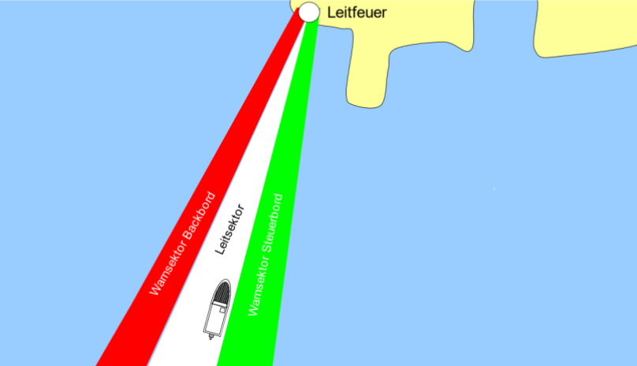

# Prüfung der Sektorgrenzen von Sektorenfeuern mittels Drohnenaufnahmen

## Einleitung

Das folgende Jupyter Notebook beschäftigt sich mit der Überprüfung der Sektorgrenzen von Sektorenfeuern anhand von Drohnenaufnahmen. Bei Sektorenfeuern handelt es sich um Seeschifffahrtszeichen, mit unterschiedlichen Kennungen oder Farben. So markiert ein Leitfeuer wie aus Abbildung 1 mittels des weißen Sektors die optimale Fahrlinie im Fahrwasser, während der Rote und Grüne Sektor die Notwendigkeit zum Korrigieren des Kurses aufzeigen.[[1]](https://doi.org/10.24053/9783739882161)

 
Abbildung 1: Leitfeuer 

Diese Sektorenfeuer sind in einigen Fällen auf eine hohe Präzision angewiesen, da diese über eine hohe Tragweite verfügen und bereits geringe Abweichungen in einer entsprechend großen Entfernung, wie beispielsweise 30 Seemeilen im Falle des Leuchtturms Campen, große Auswirkungen haben.[[2]](https://www.deutsche-leuchtfeuer.de/nordsee/campen.html)

Für die Erarbeitung von Lösungswegen für eine solche Überprüfung werden in diesem Notebook Drohnenaufnahmen des Leuchtfeuers Wybelsum verwendet. Bei diesem Handelt es sich um ein Quermarkenfeuer mit den Sektoren W 295°-320°, R -024°, W -049° an der Position N53°20'10" E07°06'20" mit einer Feuerhöhe von 16 m.[[3]](https://www.deutsche-leuchtfeuer.de/binnen/ems/wybelsum.html) In Abbildung 2 ist ein Kartenausschnitt des Leuchtfeuers und dessen Sektorgrenzen zu sehen.[[4]](https://map.openseamap.org/)

 
Abbildung 2: Quermarkenfeuer Wybelsum

Die zur Verfügung gestellten Aufnahmen bestehen aus mehreren Abflügen des Sektorenfeuers bei Nacht, welche sich in Höhe und Entfernung zum Feuer unterscheiden. Die zu den Aufnahmen gehörenden Metadaten liegen als Untertitel in den `.SRT` Dateien bei. 

### Projektrahmen

Das Projekt wird im Rahmen des Moduls "Spezielle Themen der Datenwissenschaft" bei Prof. Carsten Koch an der Hochschule Emden-Leer durchgeführt. Die Idee des Projektes kam dabei von dem Wasserstraßen- und Schifffahrtsamt in Emden. Die Umsetzung erfolgt durch die Studenten Adrian Schiel(7022935), Mirko Labitzke(7021691) und Tarek Harms(7022221) im Sommersemester 2024. Das Projekt wird neben Prof. Carsten Koch noch von den studentischen Mitarbeitern Tilman Leune und Malte Czesnik betreut. Die Drohnenaufnahmen wurden ebenfalls von diesen aufgenommen und bereitgestellt.
